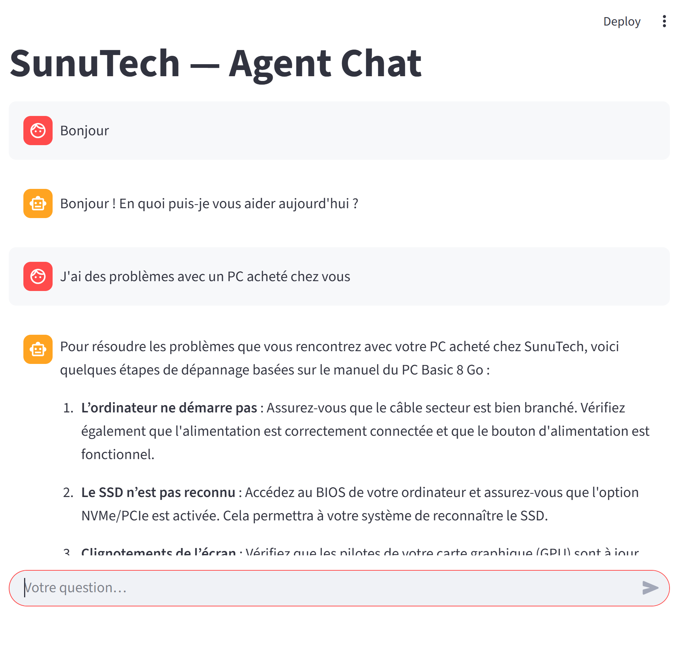

# 🤖 SunuTech Chatbot

Un agent conversationnel **multi-rôles** développé pour **SunuTech**, capable de gérer le **support client**, la **vente** et la **gestion de commandes**.  
Il combine **IA générative**, **RAG (Retrieval-Augmented Generation)** et une **base SQLite** pour offrir une expérience fluide et intelligente.


---

## 🚀 Fonctionnalités

- 🔍 **Détection d'intentions** : Support, Vente, Commande, Salutation, Remerciement, Au revoir, Escalade.  
- 💬 **Support client** : réponses issues de la documentation locale (RAG avec FAISS + embeddings OpenAI).  
- 🛒 **Agent commercial** : vérification des prix et du stock produits.  
- 📦 **Agent commande** : création, suivi et mise à jour des commandes clients.  
- 🧠 **Orchestration intelligente** avec `LangGraph`.  
- 💻 **Interface utilisateur simple et interactive** via `Streamlit`.

---

## 🏗️ Architecture technique

| Composant | Description |
|------------|-------------|
| **Frontend** | [Streamlit](https://streamlit.io/) |
| **Orchestration d'agents** | [LangGraph](https://python.langchain.com/docs/langgraph) |
| **LLM** | OpenAI GPT-4o (configurable via `.env`) |
| **RAG** | FAISS + OpenAI embeddings (`text-embedding-3-small`) |
| **Base de données** | SQLite (`sunutech_db.sqlite`) |
| **Backend logique** | `agent_graph.py`, `tools.py`, `rag_system.py` |

---

## 📂 Structure du projet

```

.
├── app.py                # Interface Streamlit
├── agent_graph.py        # Orchestration LangGraph (agents multi-rôles)
├── rag_system.py         # Système RAG (chargement docs + index FAISS)
├── tools.py              # Outils métiers (inventaire, commandes, statuts)
├── setup_db.py           # Script de création et d'alimentation de la DB
├── donnees/              # Dossier des fichiers utilisés pour le RAG (.txt / .pdf)
├── images/
│   └── screenshot1.png   # Capture d'écran de l'interface Streamlit
├── USAGE.md              # Exemples d'usage complets
├── requirements.txt      # Dépendances Python
└── README.md

````

---

## ⚙️ Installation

### 1. Cloner le projet

```bash
git clone https://github.com/elinguiuriel/sunutech-chatbot.git
cd sunutech-chatbot
````

### 2. Créer un environnement virtuel

#### Sous **Windows (PowerShell ou CMD)**

```powershell
python -m venv venv
.\venv\Scripts\activate
```

#### Sous **Linux / macOS**

```bash
python3 -m venv venv
source venv/bin/activate
```

### 3. Installer les dépendances

```bash
pip install -r requirements.txt
```

---

## 🔑 Configuration de la clé API OpenAI

Crée un fichier `.env` à la racine du projet :

```env
OPENAI_API_KEY=ta_cle_api_openai
```

Tu peux aussi exporter la clé directement dans ton environnement système :

#### Sous **Linux / macOS**

```bash
export OPENAI_API_KEY="ta_cle_api_openai"
```

#### Sous **Windows PowerShell**

```powershell
setx OPENAI_API_KEY "ta_cle_api_openai"
```

> ⚠️ Redémarre ton terminal après l'exécution de `setx` pour que la variable soit prise en compte.

---

## 🗄️ Initialisation de la base de données

Crée et alimente la base SQLite par défaut :

```bash
python setup_db.py
```

Cela crée `sunutech_db.sqlite` avec 10 produits par défaut.

---

## 📚 Ajout de documents pour le RAG

Place tes fichiers `.txt` et `.pdf` dans le dossier `donnees/`.
Ils seront automatiquement chargés et indexés par le module `rag_system.py` pour enrichir les réponses du chatbot.

---

## ▶️ Lancement de l'application

Démarre le chatbot :

```bash
streamlit run app.py
```

Puis ouvre ton navigateur sur :

* 🌐 [http://localhost:8501](http://localhost:8501)

---

## 🧪 Exemples d'utilisation

Les scénarios détaillés (support, vente, commande, statut, etc.) sont disponibles dans le fichier [USAGE.md](./USAGE.md).

Exemples rapides :

| Type d'intention    | Exemple de question                                |
| ------------------- | -------------------------------------------------- |
| **Support**         | “Comment installer un SSD NVMe ?”                  |
| **Vente**           | “Quels ordinateurs portables avez-vous en stock ?” |
| **Commande**        | “Je veux acheter 2 SSD 1To.”                       |
| **Statut commande** | “Où en est ma commande 3 ?”                        |
| **Salutation**      | “Bonjour !”                                        |
| **Remerciement**    | “Merci beaucoup !”                                 |
| **Au revoir**       | “Bonne journée, à bientôt.”                        |

---

## 🖼️ Capture d'écran

Un aperçu de l'interface utilisateur :



---

## 🛠️ Dépannage rapide (Windows)

| Problème                | Solution                                                                      |
| ----------------------- | ----------------------------------------------------------------------------- |
| `streamlit` non reconnu | Active bien le venv : `.\venv\Scripts\activate`                               |
| Problème de clé API     | Vérifie le fichier `.env` ou la variable `OPENAI_API_KEY`                     |
| Erreur SQLite           | Supprime `sunutech_db.sqlite` puis relance `python setup_db.py`               |
| Port déjà utilisé       | Lance Streamlit sur un autre port : `streamlit run app.py --server.port 8502` |

---

## 🗺️ Roadmap

* [ ] Interface enrichie (icônes, thèmes, historique)
* [ ] Authentification utilisateurs
* [ ] Paiement et gestion des factures
* [ ] Support multilingue (FR / EN)
* [ ] Connexion à un CRM (HubSpot / Salesforce)

---

## 🤝 Contribution

Les contributions sont bienvenues :

* Ajout de nouveaux outils métiers
* Amélioration des prompts et du RAG
* Tests unitaires et intégration continue

Pour proposer une amélioration :

1. Forke le projet
2. Crée une branche (`feature/ma-fonctionnalite`)
3. Ouvre une Pull Request

---

## 📜 Licence

Projet développé par **ELINGUI Pascal Uriel** — Tous droits réservés.
Usage autorisé à des fins d'étude, démonstration ou formation.
